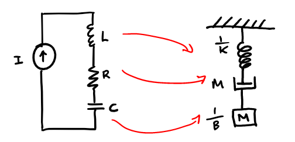
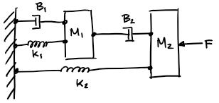
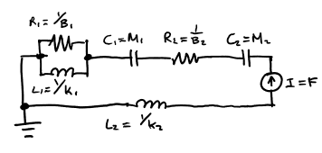
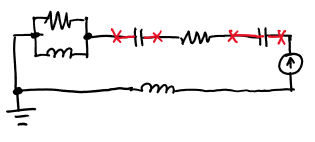

There are mathematical similarities between linear electric systems and linear mechanical systems. Every electric system has **resistance**, **capacitance**, **inductance**,  state of **voltage**, and **current**. Every mechanical system has **mass**, **friction**, **spring**, state of **force**, and **velocity**.

For the sake of consistency, let us define the following equivalence:

- Let **current** in an electrical system be equivalent $$\equiv$$ to **force** in a mechanical system.

- Let **voltage** in an electrical system be equivalent $$\equiv$$ to **velocity** in a mechanical system.

> Note that we can define it the other way, but it means all of the equivalences for resistance, capacitance, inductors, etc will be flipped.

Ohm's law is $$V=IZ$$, and using our definitions, we can have an Ohm's law for mechanical systems:

$$
V=FZ
$$

Where $$V$$ is the velocity, $$F$$ is the force, and $$Z$$ is some *mechanical impedance*.

## Electrical

**Purely Resistive**: in a purely resistive system, $$V=IR$$ by Ohm's law.

**Purely Capacitive**: in a purely capacitive system, $$V=I\frac{1}{sC}$$ where $$\frac{1}{sC}$$ is the impedance of the capacitor and $$s$$ is the complex frequency $$j\omega$$. Notice that we can rearrange the equation to:

$$
V=\frac{1}{C}\frac{I}{s}
$$

Recall from the Laplace transforms that division by $$s$$ is integration $$\int$$ in time domain. Thus the voltage in a purely capacitive system is a function of integration of current.

**Purely Inductive**: in a purely inductive system, $$V=IsL$$, similarly, $$sL$$ is the impedance of the inductor. However we can rearrange once again:

$$
V=L(sI)
$$

Recall multiplication by $$s$$ is taking the derivative. Thus the voltage in a inductive system is a function of rate of change in current.

## Mechanical

**Purely Friction**: in a system only consists of friction (such as a damper), $$F=BV$$ where $$F$$ is the force exerted, $$B$$ is the friction coefficient, and $$V$$ is velocity.

Since we defined earlier that $$V$$ for velocity, then by rearranging we get the relationship

$$
V=\frac{1}{B}F
$$

The mechanical impedance for a system with only friction is $$Z=1/B$$.

**Purely Mass**: in a system only consists of mass, $$F=ma$$, where $$m$$ is mass and $$a$$ is acceleration. To relate this to $$V$$, notice that $$a$$ is first derivative of $$V$$. In Laplace domain, this would simply be a multiplication by $$s$$. Rearrange and we get:

$$
V=\frac{1}{m}\frac{1}{s}F
$$

Notice that we're integrating force in time domain. The mechanical impedance is $$Z=1/ms$$

**Purely Spring**: in a spring system, the force by the spring is $$F=kx$$ where $$x$$ is the displacement. Note that we can relate $$V$$ to $$x$$ by integration, or division by $$s$$ in Laplace domain. It follows:

$$
V=\frac{1}k sF
$$

Notice that we're taking the derivative of force in time domain. The mechanical impedance is $$Z=s/k$$.

## Equivalence

By matching electrical and mechanical impedances, we get:

$$
\boxed{
    \begin{aligned}
    R &\equiv \frac{1}{B}\\
    C &\equiv m \\
    L&\equiv\frac{1}{k}

    \end{aligned}
}
$$

Thus, the following electrical LRC system driven by a current source is equivalent to a simple spring mass damper mechanical system driven by some force.

The two systems will have identical response:

- The current source will apply a constant current to the circuit / a uniform force applies to the spring-mass-damper system (i.e. gravity)
- The inductor will resist change in current / the spring will resist change in displacement
- The resistor will have a voltage drop that depends on the current / the damper will reduce speed that depends on force
- The capacitor will charge up and discharge / the mass will move and have momentum

## Conversion

We can convert a mechanical system to electrical, or vise versa, and it makes it easy to solve the system  (i.e. using mesh / nodal methods / MNA [^mna] that works on circuits in spring-mass-damper systems).

Generally we can map the components in the two systems one-to-one, however there are some rules regarding the layout:

- No matter where a mass is in a mechanical system, one of its node in the electrical equivalence must be connected to ground
- If a force/velocity applied in a mechanical system is relative to ground, the equivalent current/voltage source in the electrical system must be connected to ground.

> **Example:** convert the following mechanical system to its electrical equivalence
>
> 
>
> **Naïve solution:** We literally switch all the dampers with resisters, mass with capacitors, and springs with dampers. Then set the leftmost node connecting $$B_1$$, $$k_1$$ and $$k_2$$ as ground.
>
> 
>
> This will **not** yield the same response as it's not the same system. The two capacitors have none of its nodes connected ground.
>
> 
>
> **Solution:** Because we know that mass are relative to ground at all times, we start with capacitors, with one of its end nodes connected to reference.
>
> `insert`
>
> We also know that the applied force on $$M_2$$ is relative to ground, so we add the current source to the node shared with $$M_2$$, with the other end node connected to ground.
>
> `insert`
>
> Lastly, we can connect everything else.

[^mna]: [https://en.wikipedia.org/wiki/Modified_nodal_analysis](https://en.wikipedia.org/wiki/Modified_nodal_analysis)
