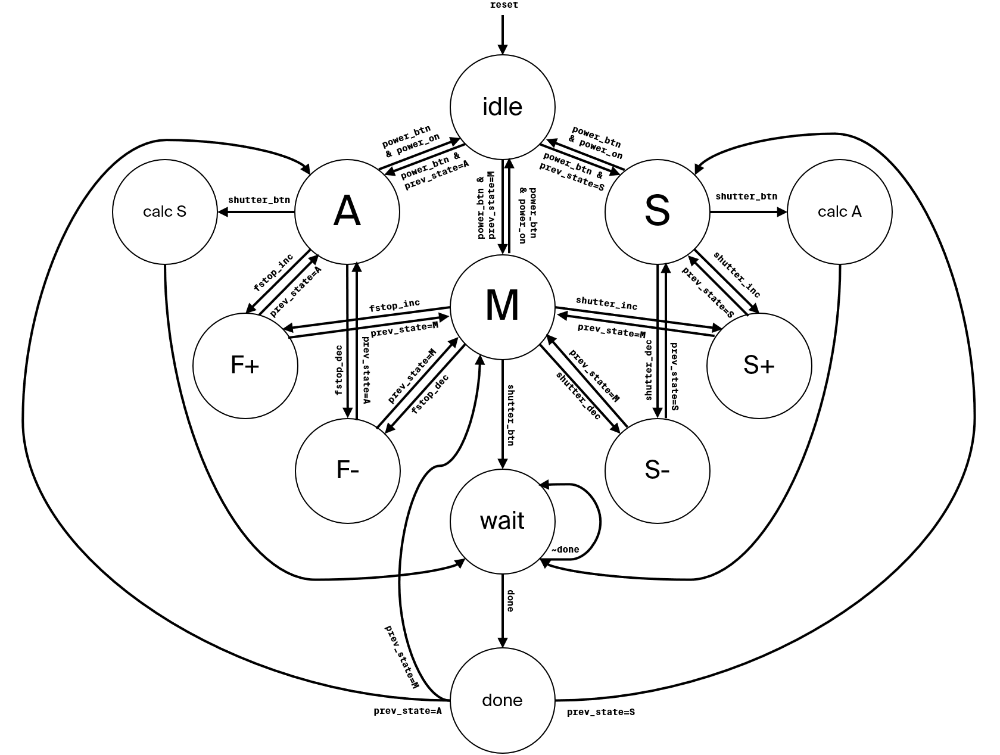
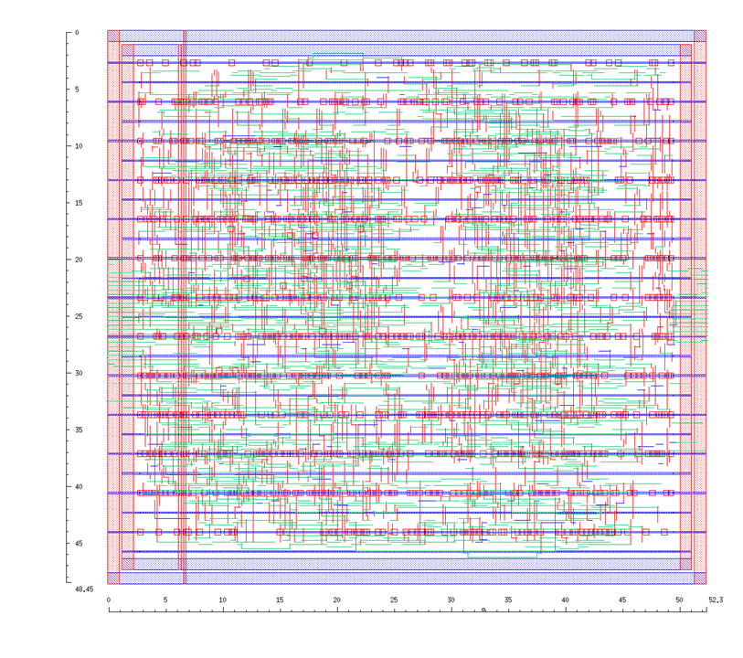

---

title: "Project 5 - PnR, Domino, and Memory"
date: 2019-12-01
categories: ELEC 402
ubc_handin: true
use_math: true
---

- toc
{:toc}

## 1. Place and Route

### FSM Design

As designed and mentioned in [project 1](proj1) and [project2](proj2), the FSM I implemented is a simple and abstract model of a digital camera. It features 10 states of operation:



### Input and Output

This subsection describes all the input/output of the FSM.

#### Input

There are a total of 11 inputs.

1. `clk`: the clock signal.
2. `fstop_dec`: Decreases the F-stop value when in A or M mode.
3. `fstop_inc`: Increases the F-stop value when in A or M mode.
4. `mode_dec`: Cycles to the previous mode.
5. `mode_inc`: Cycles to the next mode.
6. `power_btn`: Toggles the camera between idle/operating modes.
7. `reset`: Master reset signal.
8. `sensor_data[]`: A bus of 16 bits that contains the raw value for an imaginary 1x1 sensor.
9. `shutter_btn`: The main signal to take a picture.
10. `shutter_dec`: Decreases the shutter speed when in S or M mode.
11. `shutter_inc`: Increases the shutter speed when in S or M mode.

#### Output

There are just two outputs.

1. `output_data[]`: A bus of 16 bits that contains the post-processed output data.
2. `output_data_valid`: Signal that indicates top-level device that the bus `output_data` is valid and that the FSM has finished with the current task, and returning to the previous operating mode state.

### Layout

I used *Cadence Encounter &reg;* to produce the standard cell layout. The layout of the placed and routed design is shown in the image below. The final size of the total design is 52.3 &mu;m in width and 48.45 &mu;m in height. All the inputs signal pins are placed on the left and output signal pins are placed on the right.

Gaps in the standard-cell layout is filled with filler of size 1, 2, 4, and 8 to ensure design validations are passed.



### Testing Procedure

To ensure that the layout is functioning exactly as it is designed, the same test-bench used for [project 1](proj1) and [2](proj2) is used here. There exists *assertions* placed throughout the test-bench to ensure that data flow and appropriate states are correct.

Lastly, I visually inspect the waveform in *ModelSim* using the output of previous project waveforms as reference (see [next section](#output-waveform)).

#### Output Waveform

The image below shows the simulation waveform *after* layout using SDF. Note that some test signals are optimized away by ModelSim, however the result (sequences of states and output values) are still correct.


For reference, the image below shows the waveform of the synthesized FSM (mapped) from Cadence RTL. The output is identical.


For even further reference, the image below shows the waveform of the unmapped FSM. The output is still identical.


#### Test Files

The following is the test bench .sv file is used test the FSM. Linked version also available on [GitHub here](https://github.com/FSXAC/ELEC402/blob/master/proj5/test_fsm.sv).

```verilog
/* This is a modified version of the test_fsm.sv from project 1 and 2
 * CHANGES INCLUDE:
 * - Added timescale specification at the top
 * - Commented out asserts that acces DUT.ST_...  since those are reduced to bits
 */

`timescale 1ps/1ps

module test_fsm();
	logic clk;
	logic reset;
	logic power_btn;
	logic mode_inc;
	logic mode_dec;
	logic fstop_inc;
	logic fstop_dec;
	logic shutter_inc;
	logic shutter_dec;
	logic shutter_btn;
	logic [15:0] sensor_data;

	logic [15:0] fsm_output;
	logic fsm_output_valid;

	// For simulation debugging
	logic [799:0] current_test;

	fsm DUT(
		.output_data(fsm_output),
		.output_data_valid(fsm_output_valid),
		.*
	);

	// Clock generator
	always #2 clk = ~clk;

	initial begin
		// Initial values
		clk = 1;
		reset = 0;
		power_btn = 0;

/* Read the full file at the link described above */
```

## 2. Domino Logic


### Logic Function

All nodes are charged to VDD during the pre-charge phase, the only time that the input node to the inverter will discharge (go to 0) is that is that `AB(C+D)` is true.

$$
Out=A\wedge B\wedge(C\vee D)
$$

### Worst Case Charge Sharing

## 3. TG Logic

## 4. SRAM

## 5. FPGA Logic

We first use a K-map to find the logic function from the truth table. Also for the sake of simplicity, I will reassign A<sub>3</sub>, A<sub>2</sub> A<sub>1</sub>, A<sub>0</sub> to $DCBA$. As shown in the drawing below, the sum of products can be deducted:


$$
Z=DC+C\bar{A}+\bar{D}\bar{C}BA
$$

The FPGA only has 3-bit LUT so we need to split this function into smaller functions such that each smaller function only takes in 3 inputs.

$$
Z=\overbrace{\underbrace{DC+C\bar{A}}_E+\underbrace{\bar{D}\bar{C}B}_FA}^{Z}
$$

As seen in the expression above, 3 logic blocks are required. Each block’s 3-LUT will be populated based on the above expressions:

$$
E=DC+C\bar A,\quad F=\bar D\bar C B,\quad Z=E+FA
$$

The completed PLB in the FPGA looks like this:


Note that because everything is combinational logic, the 2MUX at the end of each PLB is set to `1` to not use the flip-flops.