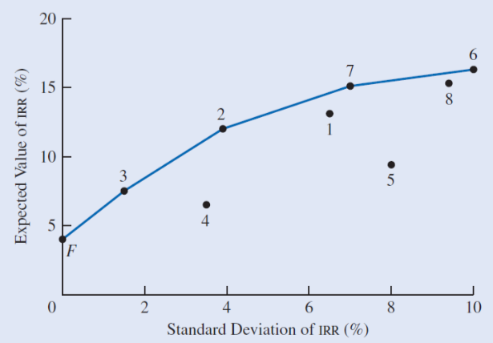

- toc
{:toc}

# Risk Analysis I

Values are described in possible ranges as estimations are inheriantly uncertain. Using [sentivity analysis](/documents/MECH431/l13) can yield how changes in variables affect the economic analysis.

**Probability** is used to consider varing data, and is based on theory, historical data, judgement, or a combination. Variables with a probability are uncertain (random / stochastic) as opposed to certain (deterministic).

> Review the notes on [probability](/documents/ELEC321/ELEC321-Module1), [conditional probability](/documents/ELEC321/ELEC321-Module2), and [random variables](/documents/ELEC321/ELEC321-Module3). (*ELEC 321 Notes - Stochastic Signals and Systems - UBC 2017*)

- In engineeing ecnomics, it is usual to have only 2-5 discrete outcomes. This is because additional outcomes require more analysis and expert judgement should limits the number of outcomes.
- The probability of an outcome is determined by its steady-state (long-run) frequency of its occurence.

## Joint Probability Distribution

[Random variables](/documents/ELEC321/ELEC321-Module3) are statistically independent - that is, the result of an outcome for one random variable, won't affect the realization of another random variable. A project criteria (NPV or IRR) depends on various input variables. Thus we have to consider the *joint probability distribution* of different combinations of input parameters.

Recall the joint probability of two independent events is given as:

$$
\mathbb P(A\cap B)=\mathbb P (A)\cdot \mathbb P(B)
$$

> **Example**: oil company
>
> Suppose the oil company has the following outcome:
>
> | Outcome                                          | Probability |
> | ------------------------------------------------ | ----------- |
> | Well being dry :cry:                             | 70%         |
> | Well being productive :smile:                    | 25%         |
> | Well being highly producitve :joy::ok_hand::100: | 5%          |
>
> But also the oil company has the following outcome for oil prices:
>
> | Outcome                        | Probability |
> | ------------------------------ | ----------- |
> | Rise in oil price :thumbsup:   | 60%         |
> | Fall in oil price :thumbsdown: | 40%         |
>
> Then there are $$2\times 3=6$$ total combinations of outcomes. The probability for each one is as follows:
>
> | Joint outcome                        | Joint probability      |
> | ------------------------------------ | ---------------------- |
> | :cry: and :thumbsup:                 | $$70\%\times 40\%=28\%$$ |
> | :cry: and :thumbsdown:               | 42%                    |
> | :smile: and :thumbsup:               | 10%                    |
> | :smile: and :thumbsdown:             | 15%                    |
> | :joy::ok_hand::100: and :thumbsup:   | 2%                     |
> | :joy::ok_hand::100: and :thumbsdown: | 3%                     |

## Expected Value

Recall from [random variables notes](/documents/ELEC321/ELEC321-Module3#header-n70) that the general equation for expected value is the sum of weighted average based on the probability of occurance:

$$
\mathbb E[g(X)]=\sum_{x}g(x)f(x)
$$

where $$X$$ is the random variable, $$g(x)$$ maps to some value or outcome, and $$f(x)$$ is the probability density function.

> **Example**:
>
> Suppose we have the following data:
>
> | Project A  |                   | Project B  | |
> | ---------- | ----------------- | ---------- |---- |
> | ***EUAB*** | ***Probability*** | ***EUAB*** | ***Probability*** |
> | \$1000 | 10% | \$1500 | 20% |
> | \$2000 | 30% | \$2500 | 40% |
> | \$3000 | 40% | \$3500 | 30% |
> | \$4000 | 20% | \$4500 | 10% |
>
> Then we can use the expected value to see which one is the better option. The expected value is computed using the equation:
>
> $$
> \mathbb E[\text{EUAB}_A]=1000(0.1)+2000(0.3)+3000(0.4)+4000(0.2)=2700\\
> \mathbb E[\text{EUAB}_B]=1500(0.2)+2500(0.4)+3500(0.3)+4500(0.1)=2800
> $$
>
> Statistically, project B would yield more benefits.

## Standard Deviation

We want to quanitfy and evalaute the **risk**. A common measure of risk is the **standard deviation**, or square root of **variance**:

$$
\begin{aligned}
\text{Variance}:&\qquad\sigma^2=\mathbb E[(X-\mu)^2]\\
\text{SD}:&\qquad\sigma=\sqrt{\mathbb E[(X-\mu)^2]}
\end{aligned}
$$

However, we only use **standard deviation** because the units match with expected value. Expanding the formula out, we get:

$$
\begin{aligned}
\sigma^2&=\mathbb E[(X-\mu)^2]\\
&=\mathbb E[X^2-2X\mu+\mu^2]\qquad\text{apply linearity property}\\
&=\mathbb E(X^2)-2\underbrace{\mathbb E(X)}_\mu\underbrace{\mathbb E(\mu)}_\mu+\underbrace{\mathbb E(\mu^2)}_{\mu^2}\\
&=\mathbb E(X^2)-\mu^2
\\
\sigma&=\sqrt{\left(\sum_xx^2f(x)\right)-\mu^2}
\end{aligned}
$$

Where $$x$$ is the outcomes in the sample space, and $$f(x)$$ is the probability density function (PDF). The larger the standard deviation, the larger the risk.

> **Example:**
>
> Suppose we have equal probability of getting \$1k, \$2k, \$3k, \$4k, and \$5k for EUAB of 20%.
>
> Then the expected EUAB is
>
> $$
> \mathbb E(\text{EUAB})=\sum_{i=1}^5 i(1000)(0.2)=\$3000
> $$
>
> Then plug the numbers into the formula and get standard deviation:
>
> $$
> \sigma=\sqrt{1000^2(0.2)+2000^2(0.2)+\dots+5000^2(0.2)-3000^2}=\$1414
> $$
>

### Risk vs. Return

**Risk vs. return** graph is a visual way to consider the risk (standard deviation) and the return (expected value).

- Risk (standard deviation $$\sigma$$) lies on the x-axis
- Return (expected value) lies on the y-axis

Note that the return is usually in the form on [internal rate of return](/documents/MECH431/l10).

> **Example**: risk vs. return graph
>
> 
>
> Notice that it's less risky when SD is lower, but the return is less.
>
> Also notice that the rate of return tapers off as SD increases meaning eventhough the return is larger, the risk is riskier.

