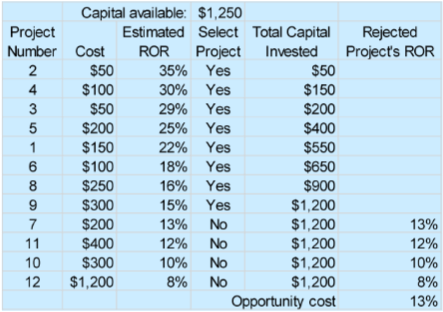

- toc
{:toc}

# Sources of Capital

**Internal** sources are generated from firm's operations (i.e. profits).

**External** sources are from money raised outside of the firm such as loans, credits, bonds, funds, mortgages. They could also be permanent one-time income (selling equity).

**Capital structure** is the mix of externally funds. Depends on the firm's decisions and needs.

> **Example**: Manufacturing plastic toys
>
> Need a mold: initial cost is \$12,000. Estimated revenue is \$5,000 first year and \$1,000 less for each year after for five years.
>
> To pay for mold, we have two external sources as options:
>
> - *Option A:* Bank loan at 18% interest.
> - *Option B:* Finance with some tool and die maker at 6% interest.
>
> We may find present worth of the total revenue of both options (using uniform and gradient present worth factor formulas to find present value).
>
> For option A: the present value is \$10,404. For option B, the present value is \$13,126. Obviously go with option B because we would be losing money in option A.

## Cost of Funds

### Debt

**Cost of debt** is the *rate of return* the debt market (i.e. lender) requires. This depends on the market's assessment of the level of risk associated with ability to repayment of the debt.

> Recall **rate of return** (ROR) is a profit on an investment over a period of time, expressed as a proportion of the original investment. [^1]

- Determined by matching market value of the debt to its future cashflows
- Often approximately equal to the rate of interest the firm is paying on the debt
- Cost of borrowed money fluctuates with inflation

### Equity

**Equity** is selling ownership in the firm to get more capital.

**Cost of equity** is the rate of return that investors require on the shares. This depends on market's assessment of level of risk associated with ability to provide returns in form of *dividends* and/or *increase in the price of shares*.

**Dividends** are a way of equity funding (common in larger institutions i.e banks). When buying/investing **preferred shares** , typically the institution will pay a dividend - a **slice/distribution** of the institution's earnings.

- Determined by matching market value off the share to future cashflows (dividend payments plus possible sales of the shares at a future data)

> **Example**:
>
> We want to rob a bank but we need a hacker to give us some money to buy some 1337haxor equipment. In return, the hacker demands 15% ROR from the heist (hacker has 15% ownership in the heist).
>
> If the heist is successful and we stole a small amount of \$1,000,000, then we have to pay the hacker \$150,000. (*Or you could just kill him*).
>
> *Sorry, I've been playing a lot of GTA V lately.*

### Risk & Rate of return

**Risk** is measured by the <mark>uncertainty</mark> of the firm's cashflows. The higher the uncertainty, the higher the risk, and typically the investor would ask for higher ROR.

There all many sources from different places. A firm's **overall cost of capital** is the weighted average of the rates of returned by the provider of all funds. Because the different sources may have different weights, the **weighted average cost of capital** (WACC) is:

$$
\text{WACC}=\sum_{\text{for }s\text{ in sources}}(\text{fraction of total capital})\cdot(\text{Rate of return for }s)
$$

The after-tax WACC is:

$$
\text{taxed}=(\text{untaxed})(1-\text{tax rate})
$$

## Investment Opportunities

Investments are selected systematically to ensure we are doing the best thing with the money. All investments made are better than the best investment opportunity rejected (*the opportunity cost*), which is the ROR of the rejected opportunity.

A simple way of ranking and selecting opportunities are shown in the table below. We rank the projects based on ROR and invest in as many high ROR projects as possible. The opportunity cost is the best opportunity rejected.

## Minimum Attractive Rate of Return

Self explanatory: it is the rate of return at which investors is willing to accept. **MARR** is the interest rate we will use for calculating present value, future value, rate of return analysis, etc.

- The lower bound of MARR is the costs of money invested.
- MARR should not be less than the capital.
- MARR should not be less than the ROR of the best rejected/forgone opportunity.

[^1]: source: [en.wikipedia.org/wiki/Rate_of_return](en.wikipedia.org/wiki/Rate_of_return)

